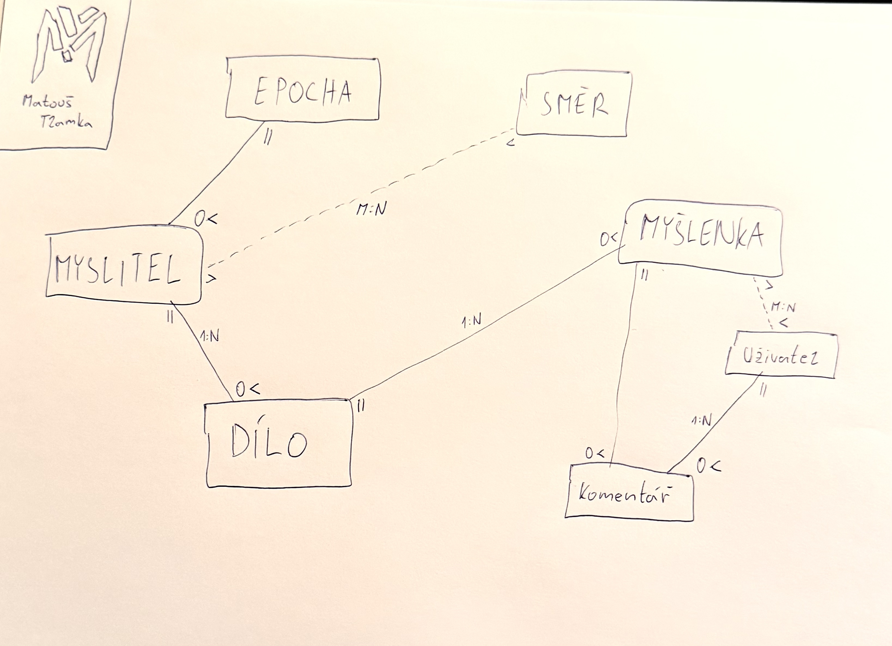

# I.D.E.A. 
## Interaktivní Databáze Epistemologie a Axiomů

**Vytvořeno v rámci předmětu Webové technologie**  
Gymnázium Arabská, Praha  
Školní rok **2025/2026**

> „Jednoduchost je vrchol sofistikovanosti.“  
> — Leonardo da Vinci

---

# Obsah

1. [O projektu](#o-projektu)  
2. [Rychlý start](#rychlý-start)   
3. [Licence](#licence)  
4. [Autor](#autor)  

---

## O projektu

I.D.E.A.
Interaktivní Databáze Epistemologie a Axiomů

Cílem tohoto projektu je vytvořit komplexní relační databázi, která systematicky mapuje vývoj lidského myšlení. V dnešní době přehlcené povrchními informacemi chci nabídnout strukturovaný nástroj pro skutečně hluboké studium.

Základními stavebními kameny celé aplikace jsou jednotliví <ins>myslitelé</ins>. Každý autor je v systému pevně ukotven a provázán se svými klíčovými <ins>díly</ins>, historickou <ins>epochou</ins> a geografickým původem. Nejde však o pouhý strohý seznam jmen. Hlavní přidanou hodnotou je úzké propojení na konkrétní <ins>myšlenky</ins>, koncepty a filozofické <ins>směry</ins> (jako je například stoicismus či existencialismus). Celá architektura je dále kategorizována podle fundamentálních disciplín, s primárním důrazem na metafyziku a gnoseologii. To umožňuje přesně sledovat evoluci určitého problému napříč staletími a pochopit tak skryté souvislosti.

Z hlediska uživatelského přístupu je web rozdělen do tří úrovní. Běžný nepřihlášený návštěvník může volně procházet veřejný katalog, filtrovat záznamy podle zadaných kritérií a číst si základní definice či životopisy.

Aby se však z pasivního čtenáře stal aktivní účastník, je vyžadována registrace. Přihlášený <ins>uživatel</ins> získává prostor pro hlubší interakci. Může k jednotlivým tezím přidávat vlastní <ins>komentáře</ins>, reflektovat přečtené texty a především si ukládat stěžejní citáty do osobního výběru. Vzniká tak izolovaný prostor pro racionální utřídění vlastního světonázoru.

Nejvyšší oprávnění drží administrátor, který ručí za faktickou správnost celého lexikonu. Přes zabezpečené redakční rozhraní přidává nové entity, spravuje relační vazby a moderuje uživatelský obsah. Po technologické stránce projekt plně využívá framework k zajištění stabilního chodu a pokročilé práce s daty.

---
---

### Databázové schéma (E-R Diagram)




### Návrh – User Flow


### Ukázka rozhraní (Wireframes)


---

# Rychlý start

### Infrastruktura a lokální nasazení (macOS)

**Postup pro spuštění:**

1. **Aktivace izolovaného prostředí:**
   Otevřete terminál v kořenovém adresáři projektu a inicializujte prostředí příkazem:
   ```bash
   source venv/bin/activate
   ```

2. **Instalace nezbytných závislostí:**
   *(Tento krok je vyžadován pouze při prvotním spuštění na novém stroji)*
   ```bash
   pip install django
   ```

3. **Iniciace lokálního serveru:**
   Pro spuštění vývojového frameworku a napojení na lokální databázi zadejte:
   ```bash
   python3 manage.py runserver
   ```

Aplikace bude dostupná typicky na:

```
http://127.0.0.1:8000
```

nebo

```
http://127.0.0.1:5000
```

---

## Licence

Tento projekt podléhá přísné proprietární licenci. **Všechna práva jsou vyhrazena.**

Plné znění licenčního ujednání, které definuje přesné hranice užití, naleznete v přiloženém souboru [`LICENSE`](LICENSE).

---

## Autor

Matouš Tlamka  
Gymnázium Arabská, Praha  
Školní rok 2025/2026
