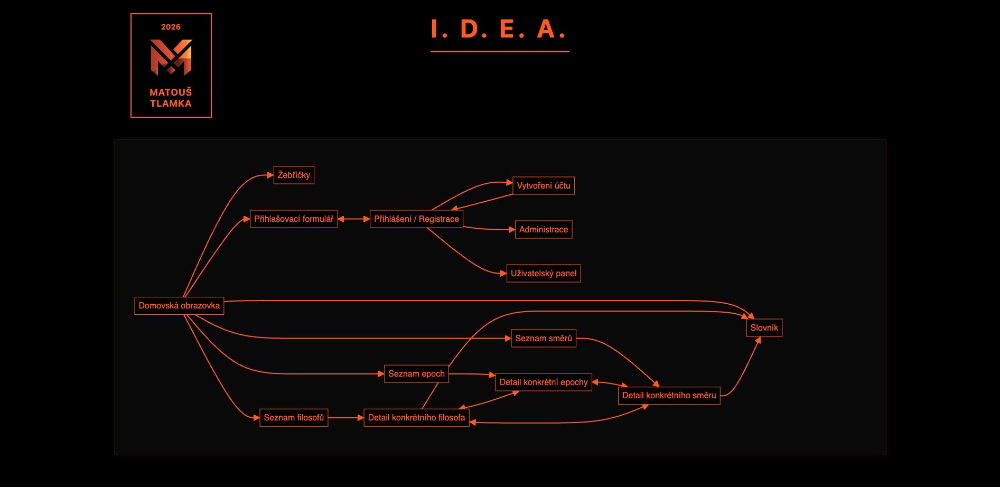
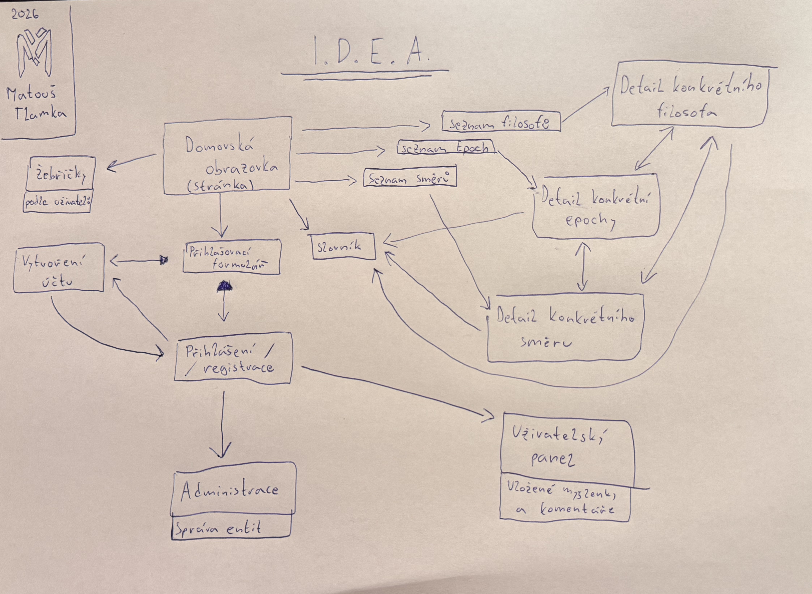
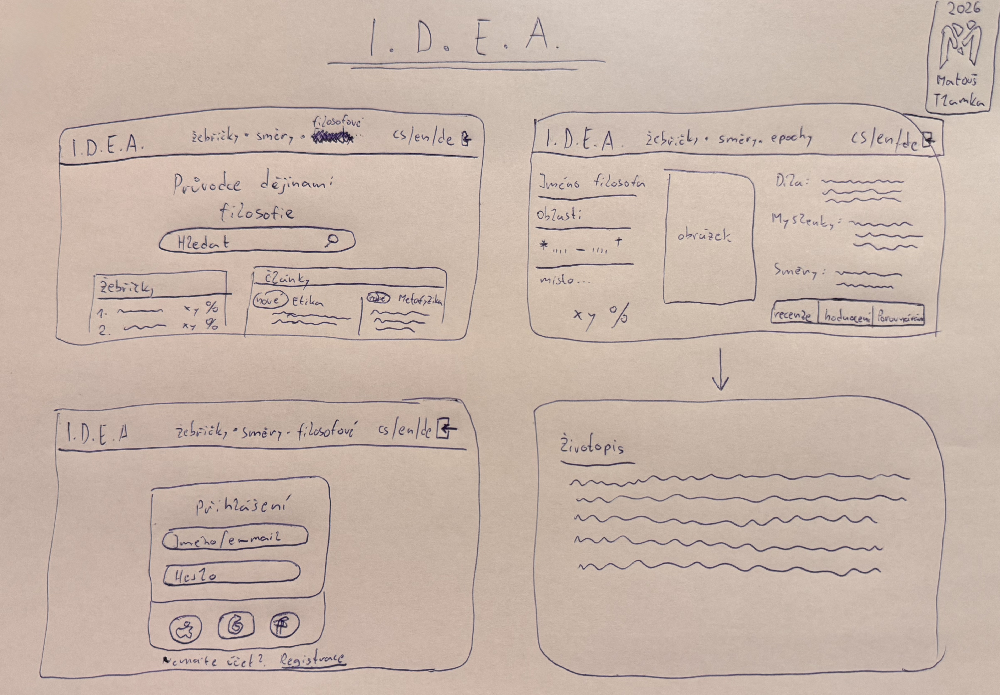
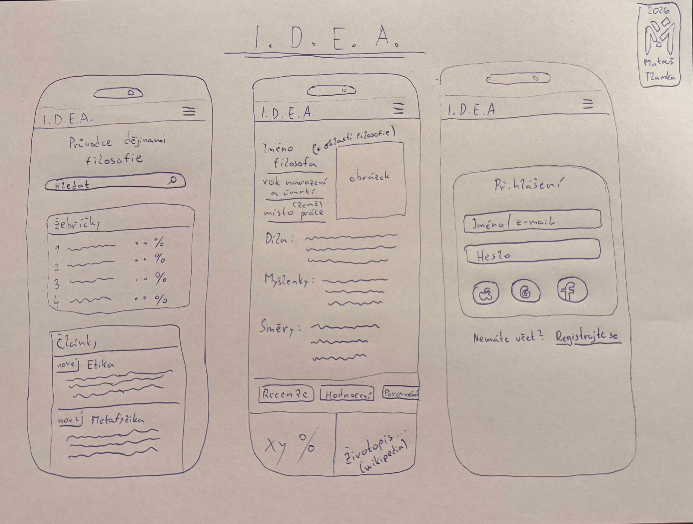

# I.D.E.A. 
## Interaktivní Databáze Epistemologie a Axiomů

**Vytvořeno v rámci předmětu Webové technologie**  
Gymnázium Arabská, Praha  
Školní rok **2025/2026**

> „Jednoduchost je vrchol sofistikovanosti.“  
> — Leonardo da Vinci

---

# Obsah

1. [O projektu](#o-projektu)  
2. [Rychlý start](#rychlý-start)   
3. [Licence](#licence)  
4. [Autor](#autor)  

---

## O projektu

I.D.E.A. Interaktivní Databáze Epistemologie a Axiomů

Cílem tohoto projektu je vytvořit komplexní relační <ins>databázi</ins>, která systematicky mapuje vývoj lidského <ins>myšlení</ins>. V dnešní době přehlcené povrchními informacemi chci nabídnout strukturovaný <ins>nástroj</ins> pro skutečně hluboké <ins>studium</ins>.

Základními stavebními kameny celé <ins>aplikace</ins> jsou jednotliví <ins>myslitelé</ins>. Každý <ins>autor</ins> je v <ins>systému</ins> pevně ukotven a provázán se svými klíčovými <ins>díly</ins>, historickou <ins>epochou</ins> a geografickým původem. Nejde však o pouhý strohý seznam jmen. Hlavní přidanou hodnotou je úzké propojení na konkrétní <ins>koncepty</ins> a myšlenkové <ins>směry</ins> (jako je například <ins>stoicismus</ins> či <ins>existencialismus</ins>). Celá <ins>architektura</ins> je dále kategorizována podle fundamentálních <ins>disciplín</ins>, s primárním důrazem na  <ins>metafyziku</ins>  a <ins>gnoseologii</ins>. To umožňuje přesně sledovat evoluci určitého problému napříč staletími a pochopit tak skryté souvislosti.

Z hlediska uživatelského přístupu je web rozdělen do tří úrovní. Běžný nepřihlášený <ins>návštěvník</ins> může volně procházet veřejný <ins>katalog</ins>, filtrovat <ins>záznamy</ins> podle zadaných kritérií a číst si základní <ins>definice</ins> či <ins>životopisy</ins>.

Aby se však z pasivního čtenáře stal aktivní účastník, je vyžadována <ins>registrace</ins>. Přihlášený <ins>uživatel</ins> získává prostor pro hlubší interakci. Může k jednotlivým <ins>tezím</ins> přidávat vlastní <ins>komentáře</ins>, reflektovat přečtené texty a především si ukládat stěžejní <ins>citáty</ins> do osobního výběru. Vzniká tak izolovaný prostor pro racionální utřídění vlastního <ins>světonázoru</ins>.

Nejvyšší oprávnění drží <ins>administrátor</ins>, který ručí za faktickou správnost celého <ins>lexikonu</ins>. Přes zabezpečené redakční <ins>rozhraní</ins> přidává nové <ins>entity</ins>, spravuje relační <ins>vazby</ins> a moderuje uživatelský obsah. Po technologické stránce projekt plně využívá <ins>framework</ins> k zajištění stabilního chodu a pokročilé práce s <ins>daty</ins>.

---
### Návrh – User Flow






### Ukázka rozhraní (Wireframes)





---

# Rychlý start

## 1. Vytvoření virtuálního prostředí

```bash
python3 -m venv .venv
```

---

## 2. Aktivace prostředí

### macOS / Linux / Git Bash / WSL

```bash
source .venv/bin/activate
```

### Windows – PowerShell

```bash
.venv\Scripts\Activate.ps1
```

### Windows – Příkazový řádek (cmd)

```bash
.venv\Scripts\activate.bat
```

Pokud PowerShell hlásí chybu o spouštění skriptů, spusť jednorázově:

```bash
Set-ExecutionPolicy -Scope CurrentUser -ExecutionPolicy RemoteSigned
```

---

## 3. Instalace závislostí

Aktualizace pip (doporučeno):

```bash
python -m pip install --upgrade pip setuptools wheel
```

Instalace projektu:

```bash
pip install -r requirements.txt
```

---

## 4. Spuštění aplikace

### Django

```bash
python manage.py runserver
```

Aplikace bude dostupná typicky na:

```
http://127.0.0.1:8000
```

nebo

```
http://127.0.0.1:5000
```

---

## Licence

Tento projekt podléhá přísné proprietární licenci. **Všechna práva jsou vyhrazena.**

Plné znění licenčního ujednání, které definuje přesné hranice užití, naleznete v přiloženém souboru [`LICENSE`](LICENSE).

---

## Autor

Matouš Tlamka  
Gymnázium Arabská, Praha  
Školní rok 2025/2026
